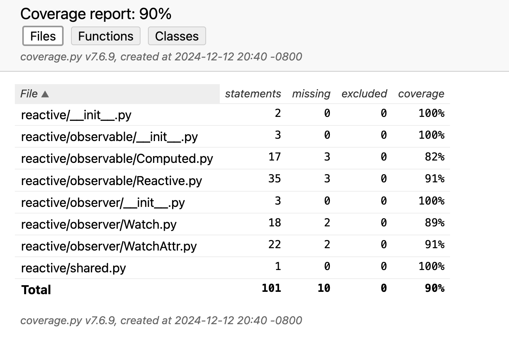

[](https://app.travis-ci.com/BI1LQV/project-step-3)


[reactive-python on PyPI](https://pypi.org/project/reactive-python/)

[](Coverage Report.png)

# Description

Reactive programming is popular in Web and APP development, where watching data change and triggering side effect (rerender) is a common practice.

Our Reactive-Python is going to implement a reactive programming package like Vue.js's Reactivity Core for Python, helping user interfaces and data streaming and processing in Python easier.

It at least includes `reactive` and `ref` to transform ordinary value or dict into watchable implement. Meanwhile, it should includes `watch`, `watchEffect` and `computed` to watch reactive values' change and register side effects.


# Submodules

## observable

### Reactive

#### Description

It is a base class for all Observable, which has a private Map attribute to store all Observers. 

It also exposes public getter and setter attributes for observed data.

#### Type

```{python}
class Reactive:
    def __init__(self, value: Any) -> Reactive:... # Set the private Map to store all Observers and store initial data.
    def __getattr__(self, key: str) -> Any:... # Hijack data access to track observers.
    def __setattr__(self, key: str, value: Any) -> None:... # Hijack data mutation and trigger observers.
    def _track(self, key: str) -> None:... # Help method for Watch to track observers.
    def _trigger(self, key: str) -> None:... # Implement of observer trigger for self.__setattr__.
    _data: dict[str, Any] # Store data.
    _observers: dict[str, set[Watch]] # Store observers.
```

### Computed

#### Description

It is inherited from base Reactive, which accepts a Watch-like lambda function to do some computation of other Reactive objects. 

It serves as a read-only computed Reactive object, which observes all dependent Reactive objects and always provide the latest computed value. 

Simply, a shortcut for Reactive + Watch.

#### Type

```{python}
class Computed(Reactive):
    def __init__(self, effect: Callable[[], Any]) -> Any:... # Accepts and pass the initial lambda function into self._update method. Set the initial data as {value: None}.
    def __setattr__(self, key: str, value: Any) -> None:... # Overwrite self.__setattr__ method to make sure its value is read-only. 
    def _update(self) -> None:... # Wrap the the initial lambda function with a mutation to self.data and pass the function into a Watch.
```

## observer

### Watch

#### Description

It accepts a pure lambda function, where Reactive object are accessed. Effect will track all accessed Reactive objects. And the lambda function will be executed every time these Reactive objects modified.

It has a private Map attribute to store all dependent Reactive objects and provides a method to stop observe.

#### Type

```{python}
class Watch:
    def __init__(self, effect: Callable[[], Any]) -> Any:... # Store the initial lambda and call self._track method.
    def __track__(self, effect: Callable[[], Any]) -> None:... # Call the initial lambda function and track all dependent Reactive objects.
    def stop(self) -> None:... # Unregister from all dependent Reactive objects and stop observing.
    _effect: Callable[[], Any] # Store effect lambda.
    _deps: set[Reactive] # Store all observers.
```

### WatchAttr

#### Description

It is inherited from base Watch, which receives specific reactive attributes to watch, rather than collecting dependent Reactive object automatically

#### Type

```{python}
class WatchAttr(Watch):
    def __init__(self, keys: Callable[[], list], effect: Callable[[], Any]) -> None:... #  Store the initial lambda and call self._track method.
    _track(self) -> None:... # Call the tracker function and track all listed Reactive attributes.
    def stop(self) -> None:... # Unregister from all dependent Reactive objects and stop observing.
```
